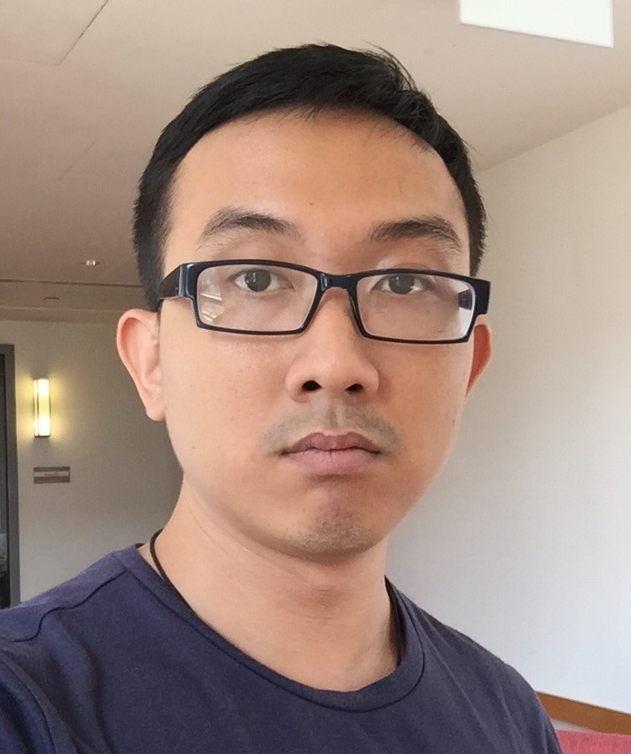

## About Me

Since August 2018, I has worked as Research Associate at [Department of Computer Science, University of Oxford](http://www.cs.ox.ac.uk/) with [Anthony W. Lin](https://anthonywlin.github.io/) on Algorithmic Verification Of String-Manipulating Programs. From September 2017 to August 2018, I took several short-term postdoc positions under [Aquinas Hobor](https://www.comp.nus.edu.sg/~hobor/) and [Jaffar Joxan](https://www.comp.nus.edu.sg/~joxan/). My CV can be found [here](./CV/lxbach.pdf).

For a brief background, I was a NUS undergraduate student (2007-2012) studying Double-Degree Program in Computer Science and Pure Mathematics (a list of taken courses can be found [here](./courses.html). After receiving two first-class bachelor's degrees in 2012, I officially (and seriously) began my research career as a CS PhD student in NUS (2013-2017) under the President Graduate Fellowship Scheme. During my PhD studies,I was very fortunate to be supervised by [Aquinas Hobor](https://www.comp.nus.edu.sg/~hobor/) and mentored by [Anthony W. Lin](https://anthonywlin.g ithub.io/).

## Research Interest

I am interested in both the practical applications and theoretical foundations of Computer Science. In particular, my research topics include (but are not limited to) developing logical frameworks/(certified) decision procedures for program verification, as well as establishing the decidability and computational complexity of the underlying logics.

## Publications

1. With Aquinas Hobor & Anthony W. Lin: Complexity Analysis of Tree Share Structure. In [APLAS 2018 (Wellington, New Zealand)](http://aplas2018.org/).
2. With Aquinas Hobor: Logical Reasoning for disjoint permissions. In [ESOP 2018 (Thessaloniki, Greece)](https://www.etaps.org/index.php/2018/esop).
3. With Toan Nguyen Thanh & Wei Ngan Chin & Aquinas Hobor: A Certified Decision Procedure for Tree Shares. In [ICFEM 2017 (Xian, China)](http://ictt.xidian.edu.cn/icfem2017/index.html).
4. With Aquinas Hobor & Anthony W. Lin: Decidability and Complexity of Tree Share Formulas. In [FSTTCS 2016 (Chennai, India)](https://www.fsttcs.org.in/archives/2016/).
5. With Cristian Gherghina & Aquinas Hobor: Decision Procedures Over Sophisticated Fractional Permissions. In [APLAS 2012 (Kyoto, Japan)](http://aplas12.kuis.kyoto-u.ac.jp/).

## My personal life

I usually hit the gym three times a week to maintain a healthy lifestyle. I am also a fan of hiking, cycling and swimming. I have experience in growing indoor hydroponic herb garden (sweet basil, thai basil, thyme, dill).

Feel free to connect with me on [Facebook](https://www.facebook.com/bachdylan)!

